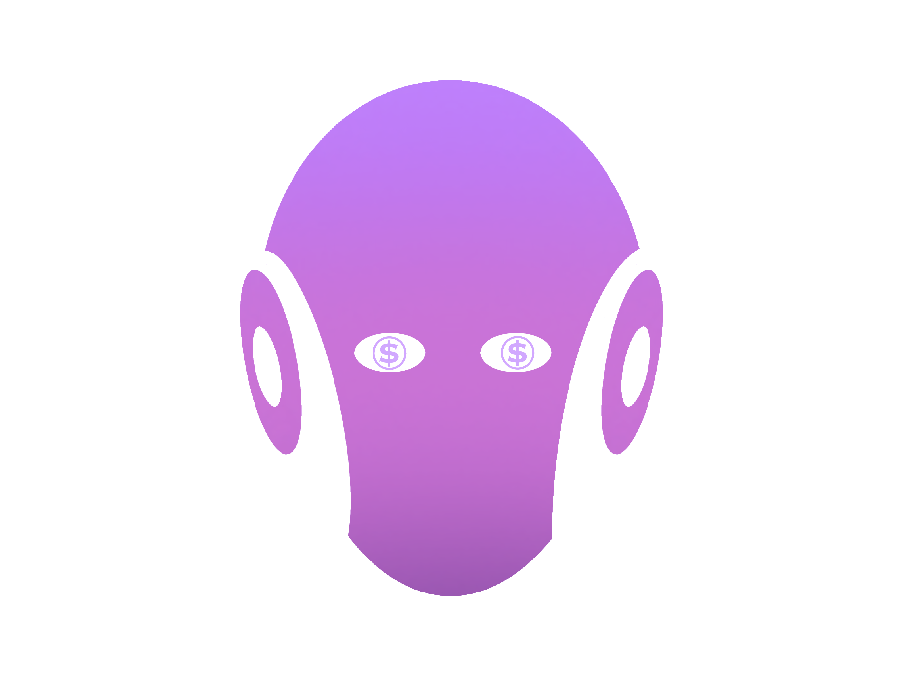

# Agent of Profits Frontend

Autonomous Ai agents navigate the ecosystem to generate profits



## 🚀 Features

- **AI-Powered Investing**: Autonomous agents navigate the ecosystem to generate profits
- **Dual Vault System**: Choose between different risk profiles (AoP1 - Medium Risk, AoP2 - High Risk)
- **Real-time Dashboard**: Monitor your investments, returns, and platform metrics
- **Seamless Web3 Integration**: Connect your wallet and interact directly with smart contracts
- **Responsive Design**: Optimized for all devices from mobile to desktop
- **Premium UI/UX**: Dark-mode optimized interface with animated components and custom typography

## 🛠️ Technology Stack

- **Frontend Framework**: Next.js with TypeScript
- **Styling**: Tailwind CSS with custom configurations
- **Animation**: Framer Motion for smooth UI transitions
- **Web3 Integration**: 
  - wagmi for contract interactions
  - RainbowKit for wallet connections
- **State Management**: React Hooks + Context
- **Blockchain**: Monad Testnet (Chain ID: 10143)

## 📝 Prerequisites

- Node.js (v16+)
- npm or yarn
- MetaMask or other Web3 wallet

## 🏗️ Getting Started

1. **Clone the repository**

```bash
git clone https://github.com/yourusername/agent-of-profits.git
cd agent-of-profits/frontend
```

2. **Install dependencies**

```bash
npm install
# or
yarn install
```

3. **Configure environment variables**

Create a `.env.local` file in the root of the frontend directory:

```
NEXT_PUBLIC_ENABLE_TESTNETS=true
```

4. **Run the development server**

```bash
npm run dev
# or
yarn dev
```

5. **Open your browser**

Navigate to [http://localhost:3000](http://localhost:3000) to view the application.

## 🔌 Connecting to Monad Testnet

The application is configured to connect to Monad Testnet by default. Make sure to add Monad Testnet to your wallet with these details:

- **Network Name**: Monad Testnet
- **Chain ID**: 10143
- **RPC URL**: https://testnet-rpc.monad.xyz/
- **Block Explorer**: https://testnet.monadexplorer.com/

## 🏛️ Project Structure

```
frontend/
├── public/            # Static assets
├── src/
│   ├── assets/        # Images and other assets
│   ├── components/    # Reusable UI components
│   ├── config/        # Blockchain configuration
│   │   ├── abis.ts    # Contract ABIs
│   │   ├── chains.ts  # Blockchain network configs
│   │   ├── contracts.ts # Contract addresses
│   │   └── tokens.ts  # Token addresses and metadata
│   ├── lib/           # Utility libraries
│   ├── pages/         # Next.js pages
│   ├── styles/        # Global styles
│   └── utils/         # Helper functions
├── .env.local         # Environment variables
├── next.config.js     # Next.js configuration
├── tailwind.config.js # Tailwind CSS configuration
└── tsconfig.json      # TypeScript configuration
```

## 💰 Key Smart Contracts

The frontend interacts with the following smart contracts:

- **VaultFactory**: Creates and manages both types of vaults
- **AoP1Vault**: Medium risk vault with dual-asset strategy (MON + USDT)
- **AoP2Vault**: High risk vault with single-asset strategy (USDT-only)

## 🎨 Design System

The UI leverages a modern, dark-themed design system with:

- **Typography**:
  - Display Font: Space Grotesk (geometric, technical)
  - Body Font: Outfit (modern, versatile)
- **Color Palette**:
  - Primary: Purple/Indigo gradient (#8B5CF6 → #6366F1)
  - Backgrounds: Rich blacks (#121212, #0F172A)
  - Accents: Pink (#D946EF), Cyan (#06B6D4)

## 🚢 Deployment

This project is configured for easy deployment to Vercel:

```bash
npm run build
# or
vercel deploy
```

## 🔧 Troubleshooting

If you encounter wallet connection issues:

1. Ensure your wallet is configured for Monad Testnet
2. Check that you have testnet USDT and MON tokens
3. Verify the correct contract addresses in the configuration

## 🔐 Security

This project uses environment variables for sensitive information. Never commit your private keys or sensitive information to the repository.

## 📜 License

[MIT](LICENSE)

## 🙏 Acknowledgments

- The Monad team for providing testnet infrastructure
- All contributors who have helped develop the Agent of Profits platform
